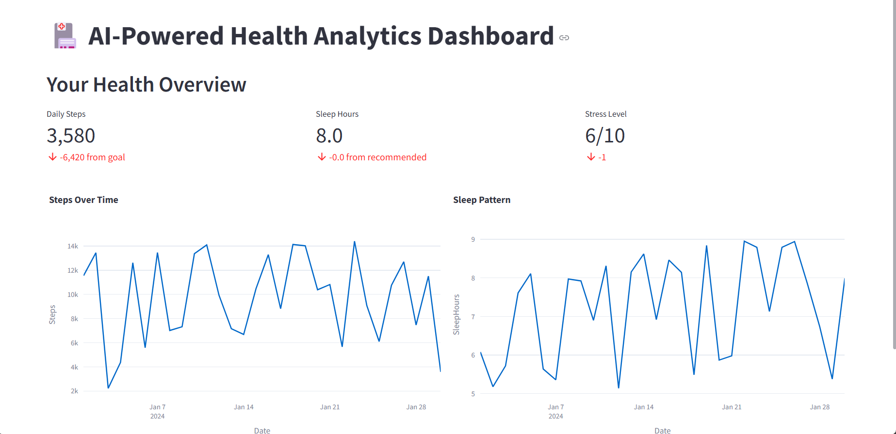
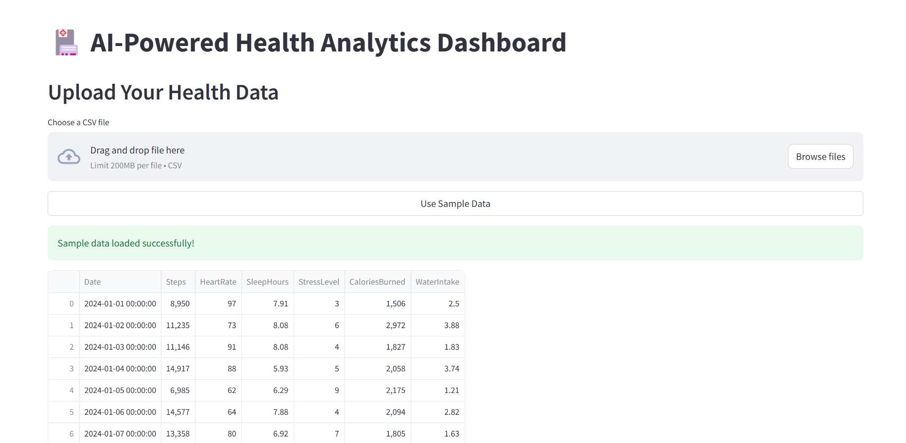
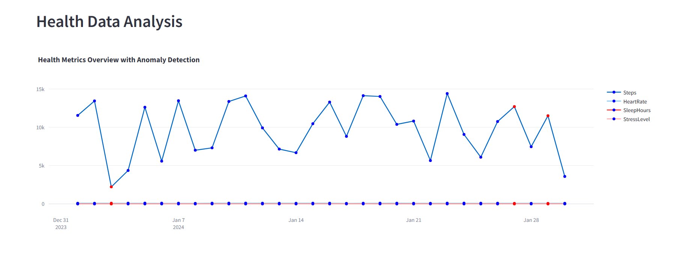
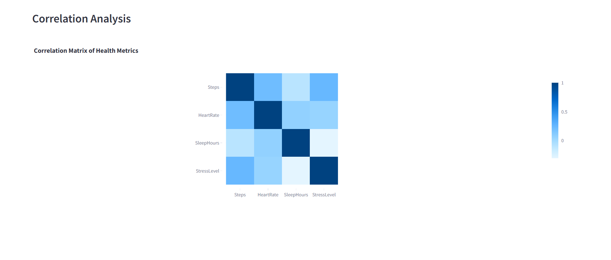
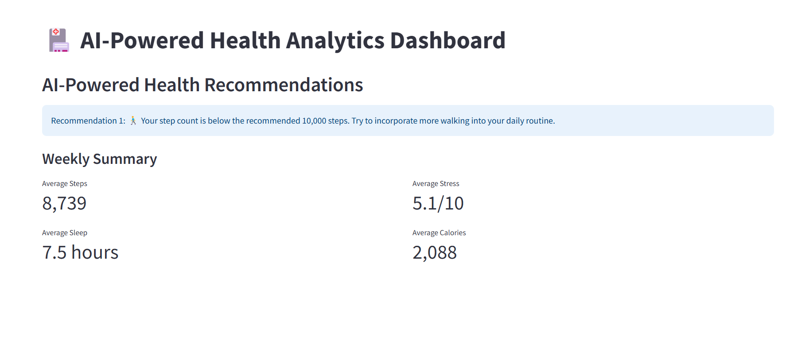

# AI-powered Personal Health Analytics Dashboard

This web application is designed to provide insights into personal health data, including activity levels, sleep patterns, stress, and more. It uses AI techniques to detect anomalies in health metrics and provides personalized recommendations based on the user's current health data.

## Key Features of this Application

### 1. **Dashboard**
- Real-time health metrics visualization
- Interactive charts for steps, sleep, and other vital signs
- Daily metrics comparison with recommended values

### 2. **Data Upload**
- CSV file upload support
- Sample data generation for testing
- Data validation and error handling

### 3. **Analysis**
- Anomaly detection using Isolation Forest
- Correlation analysis between different health metrics
- Interactive visualizations with Plotly

### 4. **AI-Powered Recommendations**
- Personalized health recommendations based on current metrics
- Weekly summary statistics
- Progress tracking against health goals

## Technologies Used
- **Streamlit**: For creating the web interface.
- **Plotly**: For interactive visualizations.
- **scikit-learn**: For anomaly detection using Isolation Forest.
- **Pandas**: For data manipulation.
- **NumPy**: For numerical computations.

## Installation

To run this app locally:

1. Clone the repository:
    ```bash
    git clone https://github.com/cdrcknt/Bayesian-MedicalDiagnosis.git
    ```

2. Navigate to the project directory:
    ```bash
    cd Bayesian-MedicalDiagnosis
    ```

3. Set up a virtual environment:
    ```bash
    python -m venv venv
    ```

4. Activate the virtual environment:
    - On Windows:
      ```bash
      venv\Scripts\activate
      ```
    - On macOS/Linux:
      ```bash
      source venv/bin/activate
      ```

5. Install the required dependencies:
    ```bash
    pip install -r requirements.txt
    ```

6. Run the app:
    ```bash
    streamlit run app.py
    ```

## Screenshots

### 1. **Dashboard Overview**


### 2. **Data Upload**


### 3. **Health Metrics Analysis**



### 4. **Recommendations**


### Try it here

https://bayesian-healthdashboard.streamlit.app/

### Developers

Cedric Kent Centeno
---